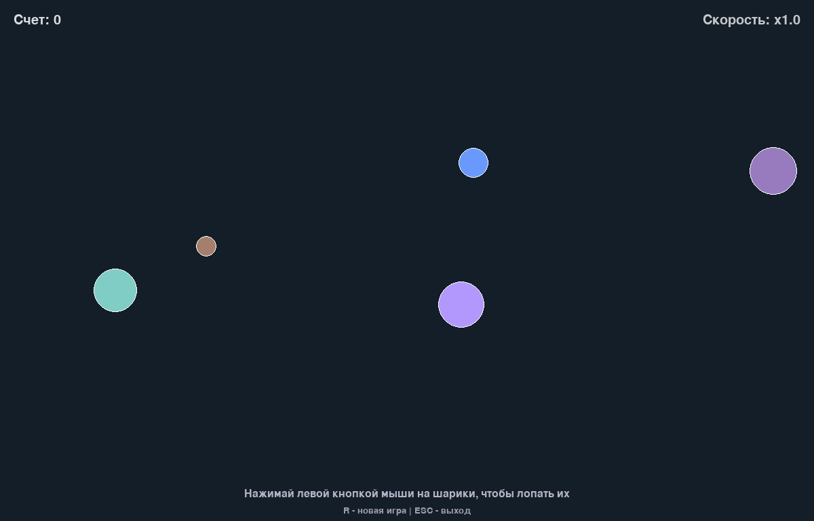
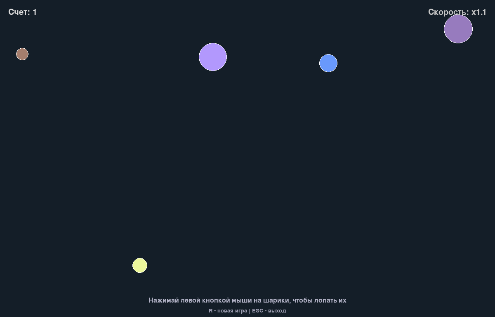
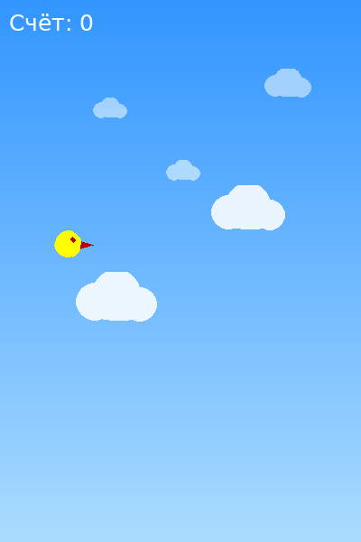

# 🐍 ООП на Python: от ужаса до понимания


Учебный проект с курса **[«ООП на Python: от ужаса до понимания»](https://stepik.org/course/239925)** (Людмила Колесникова, Stepik): две мини-игры, в которых принципы ООП проходят путь от «монолита из одного файла» к аккуратной модульной архитектуре.

Каждая игра существует в двух версиях — **до** и **после** рефакторинга. Сравнивая их, наглядно видно, зачем нужны классы, инкапсуляция и разделение ответственности.

---

## 🎮 Игры

### 🫧 «Тык-тык» — лопаем шарики

<p align="center">
  <br>
  <sub>физика столкновений: лобовое (шары «обмениваются» скоростями) и касательное (смена курса)</sub>
</p>
<p align="center">
  <br>
  <sub>а по клику мышкой шар лопается — расширяется и тает</sub>
</p>

Шарики разных размеров и цветов летают по экрану, отражаются от стен и сталкиваются друг с другом. Лови их мышкой: с каждым лопнутым шариком растёт счёт и скорость остальных.

**Что здесь интересного с точки зрения ООП и кода:**
- `Circle` инкапсулирует состояние: координаты, скорость, радиус, анимацию лопания;
- упругие столкновения кругов: раздвижение перекрытия и обмен проекциями скоростей на ось столкновения;
- «пульсация» сложности — множитель скорости от счёта;
- все настройки вынесены в конструктор `Game`, в `main.py` остаются только константы и хуки Pygame Zero.

### 🐦 Flappy Bird — пролети между трубами

<p align="center">
  
</p>

Классика жанра: жми пробел, чтобы взлетать, и пролетай в проёмы между трубами. Есть счёт, рекорд и экран проигрыша.

**Что здесь интересного с точки зрения ООП и кода:**
- физика с дельтой времени (`dt`) — одинаковое поведение при любом FPS + защита от «скачков» при лагах;
- поворот птицы по вертикальной скорости;
- точная коллизия «круг против прямоугольника» вместо грубого `Rect.colliderect`;
- два слоя облаков с параллаксом;
- состояния игры (стартовый экран / игра / проигрыш) внутри одного цикла.

---

## 🧠 Какие концепции ООП здесь отрабатываются

| Концепция | Где смотреть |
|---|---|
| **Классы и объекты** | `Circle`, `Game`, `Bird`, `Pipe`, `Cloud` |
| **Инкапсуляция** | состояние сущности живёт внутри объекта, снаружи — только `update()`, `draw()`, `jump()` |
| **Единый интерфейс сущностей** | у всех игровых объектов есть `update()` и `draw()` — `Game` обходит их одним циклом |
| **Композиция** | `Game` владеет списками кругов, труб и облаков |
| **Настройки через конструктор** | `Game(width=…, min_speed=…)` — все «ручки» собраны в `main.py` |
| **Разделение ответственности** | логика (`game.py`, `circle.py`, …) отделена от точек входа (`main.py`) и графического движка |
| **Рефакторинг монолита** | `tyk_tyk.py` и `flappy_bird.py` — «до», модульные версии — «после» |

---

## 📁 Структура проекта

```
.
├── circles_game/              # «Тык-тык» (Pygame Zero)
│   ├── circle.py              #   класс Circle: движение, отскоки, анимация лопания
│   ├── game.py                #   класс Game: состояние, счёт, столкновения
│   ├── main.py                #   точка входа: константы + хуки Pygame Zero
│   └── tyk_tyk.py             #   🕰️ первая однофайловая версия (до рефакторинга)
├── flappy_bird/               # Flappy Bird (pygame)
│   ├── bird.py                #   класс Bird: физика полёта, поворот спрайта
│   ├── cloud.py               #   класс Cloud: параллакс-облака
│   ├── pipe.py                #   класс Pipe: трубы, коллизии «круг–прямоугольник»
│   ├── game.py                #   класс Game: игровой цикл, состояния, UI
│   ├── utils.py               #   вспомогательные функции
│   ├── main.py                #   точка входа: константы + запуск
│   └── flappy_bird.py         #   🕰️ первая однофайловая версия (до рефакторинга)
├── screenshots/               # GIF и скриншоты для этого README
├── .github/workflows/ci.yml   # CI: ruff + smoke-тесты
├── pyproject.toml             # метаданные проекта и настройки ruff
├── uv.lock                    # зафиксированные зависимости
├── .gitignore
└── LICENSE                    # MIT
```

> Файлы с пометкой 🕰️ — самодостаточные первые версии игр. Запускать можно и их, но основная линия проекта — модульные версии через `main.py`.

---

## 🚀 Установка и запуск

**Требования:** Python 3.13+, [uv](https://docs.astral.sh/uv/) (или обычный `pip` — см. ниже).

```bash
# 1. Клонировать репозиторий
git clone https://github.com/Ibndaud/oop-in-python-from-terror-to-understanding.git
cd oop-in-python-from-terror-to-understanding

# 2. Установить зависимости
uv sync

# 3. Запустить игру
uv run python circles_game/main.py   # «Тык-тык»
uv run python flappy_bird/main.py    # Flappy Bird
```

<details>
<summary>Без uv (через pip и venv)</summary>

```bash
python -m venv .venv
source .venv/bin/activate        # Windows: .venv\Scripts\activate
pip install pgzero
python circles_game/main.py      # или flappy_bird/main.py
```
</details>

---

## ⌨️ Управление

| Действие | «Тык-тык» | Flappy Bird |
|---|---|---|
| Основное действие | **ЛКМ** — лопнуть шарик | **Пробел** — прыжок / старт |
| Новая игра | **R** | **R** (на экране проигрыша) |
| Выход | **ESC** | закрыть окно |

---

## 🛠️ Разработка

Линтинг (те же проверки, что выполняет CI):

```bash
uvx ruff check .
```

CI (`.github/workflows/ci.yml`) на каждый push и pull request:
- **Линтинг** — [`ruff`](https://docs.astral.sh/ruff/) с настройками из `pyproject.toml`;
- **Smoke-тесты** — компиляция всех файлов и headless-импорт игровых модулей.

## 📄 Лицензия

Проект распространяется по лицензии [MIT](LICENSE).

## 🙏 Благодарности

- [Людмила Колесникова](https://stepik.org/course/239925) — курс «ООП на Python: от ужаса до понимания»;
- [Pygame Zero](https://pygame-zero.readthedocs.io/) и [pygame](https://www.pygame.org/) — движки, на которых всё это летает и лопается.
